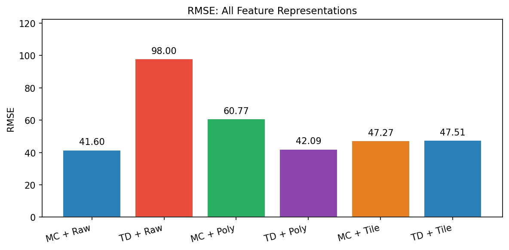
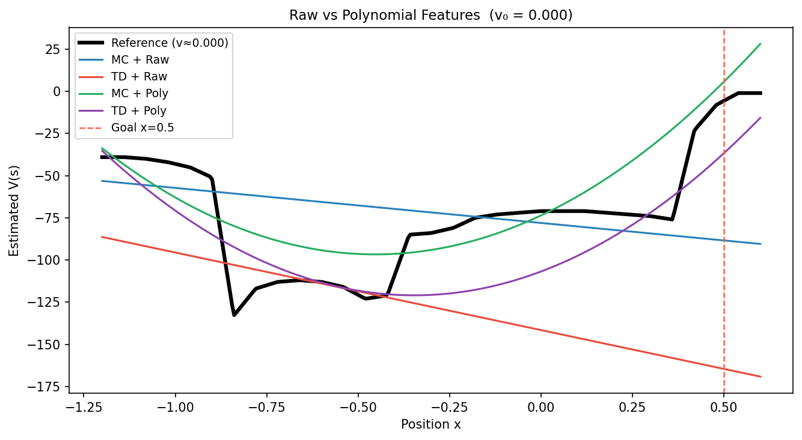
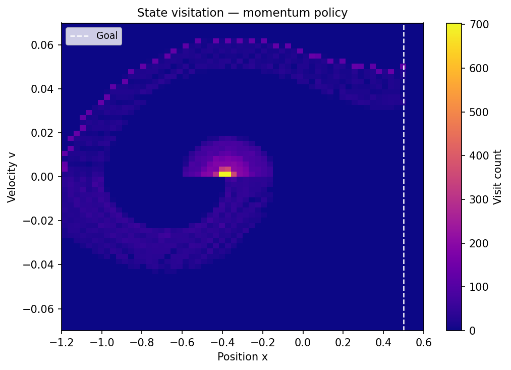
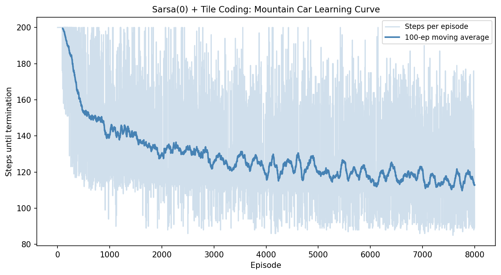

# Linear Function Approximation for Reinforcement Learning: Mountain Car

Studies policy evaluation and control in a **continuous state space** using
linear function approximation. The Mountain Car environment requires an agent
to build momentum by rocking back and forth — a task that naive greedy strategies
fail entirely.

The key challenge: the car's engine is too weak to climb directly, so the agent
must first drive *away* from the goal to build momentum. This makes sparse-reward
learning with continuous states an ideal testbed for function approximation methods.

---

## Methods

### Feature Representations

Three representations of increasing expressiveness are compared:

| Feature | Dimension | Properties |
|---|---|---|
| **Raw** | 3 | `[1, x_n, v_n]` — hyperplane approximation only |
| **Polynomial** | 6 | `[1, x_n, v_n, x_n², v_n², x_nv_n]` — adds curvature |
| **Tile coding** | N×P×V | Sparse binary; local generalisation across overlapping grids |

### Prediction Algorithms (fixed policy)

- **Monte Carlo**: full return targets — unbiased, high variance, episode-end updates
- **TD(0)**: one-step bootstrap — lower variance, biased, online updates

### Control

- **Semi-gradient Sarsa(0)** with tile-coded action-value features φ(s,a)

---

## Results

### Feature Representation Comparison (RMSE vs reference)

| Method | RMSE |
|---|---|
| MC + Raw | 41.6 |
| **TD(0) + Raw** | **98.0** ← worst |
| MC + Polynomial | 60.8 |
| TD(0) + Polynomial | 42.1 |
| MC + Tile coding | 47.3 |
| TD(0) + Tile coding | 47.5 |

TD(0) with raw features performs worst: bootstrapping from a poor approximation
amplifies bias. MC with raw features is better because its targets (full returns)
are unbiased regardless of feature expressiveness.



### Value Function Slices

The raw feature approximation produces a straight line — a hyperplane in 2D state space.
Polynomial features add curvature but miss localised structure. Tile coding tracks the
reference more closely in high-visitation regions.



### State Visitation Heatmap

Accuracy of the tile-coded approximation correlates directly with visitation density:
tiles that are never activated during training retain their initial value of zero.



### Sarsa(0) Control — Learning Curve

| Metric | Value |
|---|---|
| Initial avg steps (ep 1–100) | ~200 (max, failing) |
| Final avg steps (ep 7800–8000) | 116 |
| Best single episode | 85 steps |
| Max possible | 200 steps |

Sarsa(0) with tile coding reduces average episode length from 200 (failure) to ~116,
discovering the momentum-building rocking strategy automatically.



---

## Project Structure

```
mountain-car-rl/
├── environment.py   # env factory, policies, feature representations, reference value
├── algorithms.py    # MC prediction, TD(0) prediction, Sarsa(0) control
├── visualize.py     # trajectory plots, value slices, heatmaps, learning curves
├── main.py          # runs all experiments, saves results/
├── requirements.txt
└── notebooks/
    └── mountain_car_rl.ipynb
```

---

## Getting Started

```bash
git clone https://github.com/PrashantSU/mountain-car-rl
cd mountain-car-rl
pip install -r requirements.txt
python main.py
```

---

## Key Findings

**TD(0) is sensitive to feature quality.** With raw linear features, TD(0) has RMSE=98
vs MC's RMSE=42 — because bootstrapping from a poor approximation amplifies bias.
MC uses unbiased return targets regardless of feature quality.

**Tile coding generalises locally.** Approximation accuracy is highest in
high-visitation regions of state space and degrades in rarely-visited areas —
a fundamental property of tabular-style local coding.

**Sarsa(0) discovers the rocking strategy.** Without any prior knowledge of
the dynamics, the agent learns to oscillate between the two hills to build
momentum, reducing episode length by ~42% (200 → 116 steps average).

**Function approximation quality determines control ceiling.** The Sarsa agent
reaches ~116 steps on average rather than the theoretical minimum (~85) partly
because tile resolution limits the precision of the Q-function approximation.

---

## References

- Sutton, R. S., & Barto, A. G. (2018). *Reinforcement Learning: An Introduction* (2nd ed.), Ch. 9–10. MIT Press.
- Moore, A. W. (1990). *Efficient memory-based learning for robot control.* PhD thesis, Cambridge.
- Brockman, G. et al. (2016). *OpenAI Gym.* arXiv:1606.01540.
